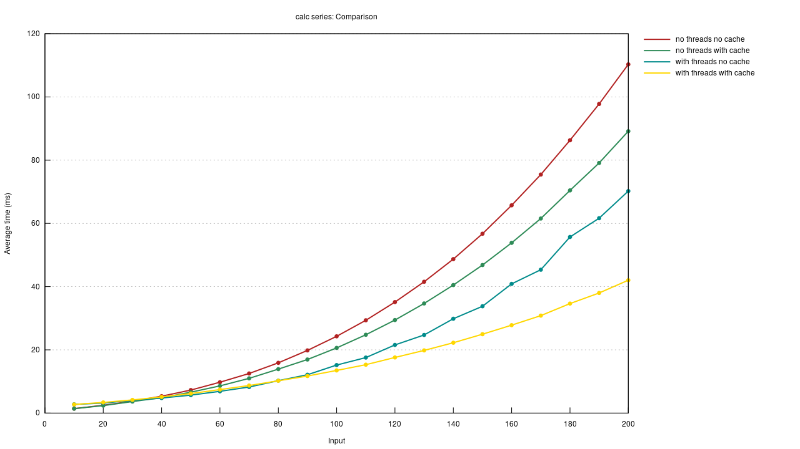

# Pi calculation multithreading test
Benchmark calculating Pi with and without multithreading and with and without factorial caching.

## How to run

Run

```
cargo bench
```

to generate the benches. *This may take a lot of time (for me it is usually up to 10-20 minutes).*

Then you can browse the generated files in `target/criterion`.
For example, open `target/criterion/report/index.html` to view a menu for all the benchmarks.

## Results

Result comparing all combinations for use of threading and cache and not using them (using 4 threads):


## Notes
The code is most likely unoptimal. For starters, it is all in one file. I couldn't figure out how to include files, so I left it like that. Also, maybe some parts of the code can be writen in a better way. That's okay. The overall results are still interesting and tell us how cache and multithreading help.